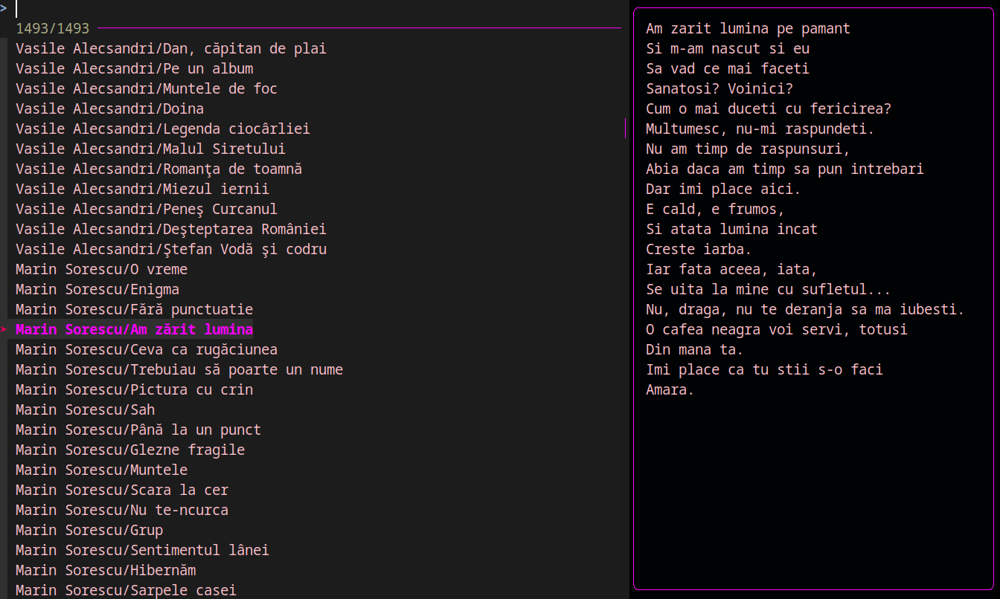

#poezii_in_cli.sh 

## Description

`poezii_in_cli.sh` is a lightweight script that brings the beauty of Romanian poetry to your CLI. With a focus on simplicity and ease of use, this script is design for searching and reading poetry from Romanian authors.



## Features

- The CLI provides a straightforward and user-friendly experience, navigating through the poetry collection with minimal effort.
- Easily search for poetry by specific authors.
- Read the full text of the selected poetry.

## Installation


1. Clone this repository

Open a terminal and change the current directory to the location where you want to clone the repository.
Type the following command and press enter:

```bash
git clone https://github.com/scriubuguri/poezii-in-cli.git
```

## Usage

1. Navigate to the `poezii-in-cli` directory with the following command:

```bash
cd poezii-in-cli
```

2. Make the `poezii_in_cli.sh` script executable and then run it to collect the poetry.

```bash
chmod +x poezii_in_cli.sh
```

and then

```bash
./poezii_in_cli.sh 
```

3. Make the `citire.sh` script executable and then run it to read the poetry.

```bash
chmod +x citire.sh
```

and then

```bash
./citire.sh
```

4. Enjoy the beauty of Romanian poetry!

## Author

This script was created by [scriubuguri](https://github.com/scriubuguri).


